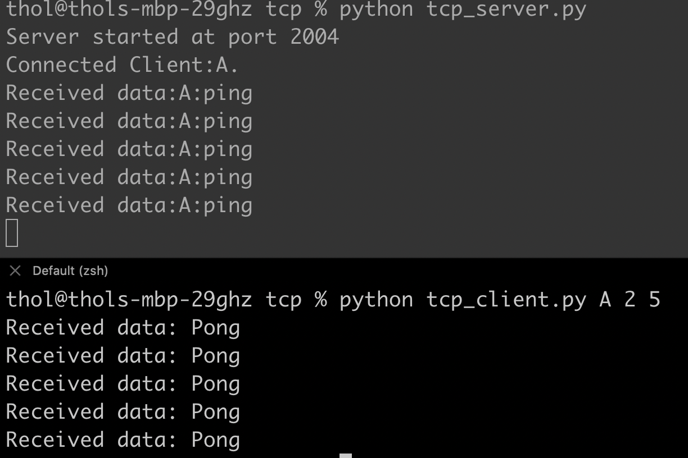
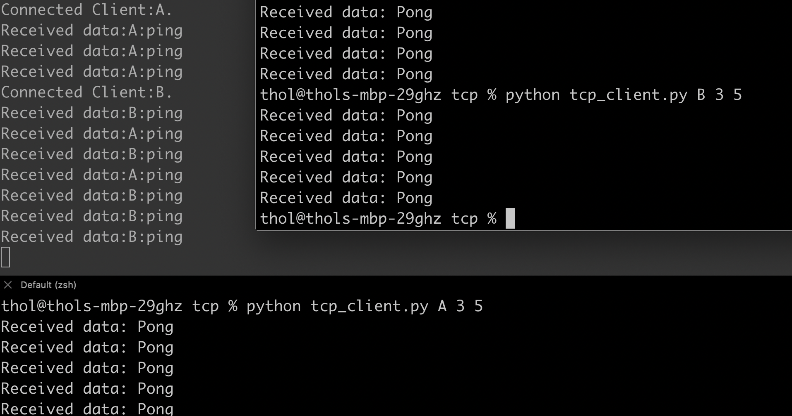

# Assignment 1 - Part A

You will be building a simple TCP server that can handle requests from multiple TCP clients. The given baseline implementation does not support handling connection from multiple clients.

## Requirements

* Add handling connection from the multiple clients and the server must be kept running forever.
* Print out the data received by the server along with client id.
* Response all clients to the "pong" message.

## Implementation screenshots

* Client A connecting to server

* Client A and B connecting to server
